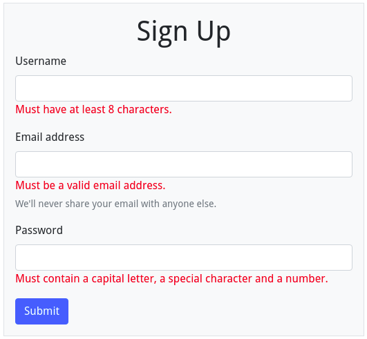
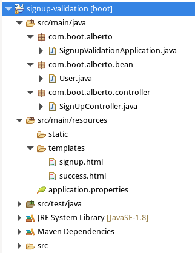

# Validation-in-Spring-Boot

We will do  a small project "signup" 

Fields

<ul>
  <li>username</li>
  <li>password</li>
  <li>confirm_password</li>
  <li>email</li>
   <li>submit button</li>  
</ul>

Constraints

<ul>
<li>Username: Must have at least 8 characters</li>
  <li>Password: Must contain a capital letter, a special character and a number.</li>
  <li>confirm_password</li>
  <li>Confirm Password: Must be equal to password field</li>
   <li>Email: Must be a valid email address.</li>  
    <li>Errors must be displayed with red color.</li>
</ul>

Below, we see result.

Your project structure will look like below.

Create a controller class named "SignUpController"

<pre>
  <code>
  package com.boot.alberto.controller;

import javax.validation.Valid;

import org.springframework.stereotype.Controller;
import org.springframework.ui.Model;
import org.springframework.validation.BindingResult;
import org.springframework.web.bind.annotation.GetMapping;
import org.springframework.web.bind.annotation.ModelAttribute;
import org.springframework.web.bind.annotation.PostMapping;

import com.boot.alberto.bean.User;

@Controller
public class SignUpController {
	
    @GetMapping(path ={"/register","/"})
    public String showForm(Model model) {
        User user = new User();
        model.addAttribute("user", user);                    
        return "signup";
    }
    @PostMapping("/register")
    public String submitForm(@Valid @ModelAttribute("user") User user, BindingResult bindingResult) {
    	if(bindingResult.hasErrors()) {
    		return "signup";
    	}
    	else {  		
    	        return "success";
    	}
       
    }
	
}

  </code>
</pre>
